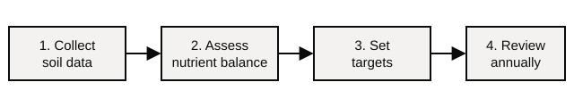

## 1 Overview

This guide explains how to check a Sustainable Farming Incentive (SFI) claim that includes nutrient management actions. It is sample content written for the prototype and is not real guidance.

### 1.1 Who this guide is for

Use this guide if you are a caseworker checking an SFI application or annual declaration that includes any of these actions:

- **NUM1** – assess nutrient use and produce a review report
- **NUM2** – legumes on improved grassland
- **NUM3** – legume fallow

Do not use this guide for Countryside Stewardship nutrient management options. They have their own guidance.

### 1.2 Before you start

Make sure you have access to:

1. the Rural Payments service, to view the agreement and land parcels
2. CRM, to read and update the case
3. the Land Management Plan viewer, if the customer uploaded a plan

> If the case was opened before 1 April 2026, check the case notes first. Earlier claims may have been checked against the previous scheme rules.

## 2 Checking the claim

### 2.1 Check which actions are claimed

Open the agreement in the Rural Payments service and compare the actions claimed against the land parcels they are claimed on.

| Action | Where it can be claimed | Evidence to check |
| --- | --- | --- |
| NUM1 | Once per agreement, not per parcel | - Nutrient management review report - Soil test results (no more than 5 years old) |
| NUM2 | Improved grassland parcels only | - Seed invoice or receipt - Dated photograph of the sward |
| NUM3 | Arable and temporary grassland parcels | - Seed invoice or receipt |

Replace [\[SBI\]]{.red} with the customer's Single Business Identifier in every case note you write.

### 2.2 Check the review report

For NUM1, the review report must be produced by a suitably qualified adviser and must cover every land parcel in the agreement.

The report should show the steps in this order:

If the report does not cover every land parcel, ==raise a query with the customer== before going any further. Do not reject the claim at this stage.

### 2.3 Check combinations with other actions

Some actions cannot be claimed on the same area of land in the same year. Check the combinations table in the SFI scheme rules. The most common problems are:

- NUM2 and NUM3 claimed on the same parcel
- NUM3 claimed alongside an arable action that already requires a fallow period

If you find a combination that is not allowed, record it as an anomaly on the case.

## 3 Finishing the check

### 3.1 Record your decision

Add a case note using this template, replacing the red text:

> Nutrient management actions checked for [\[SBI\]]{.red}. Evidence reviewed: [\[list the evidence\]]{.red}. Outcome: [\[pass or query\]]{.red}.

Then set the case status to **Checked** if everything passed, or **Awaiting customer** if you raised a query.

### 3.2 If the customer does not respond

If a query is open for more than 30 days with no response, send the reminder letter from CRM. If there is still no response after another 14 days, refer the case to your team leader.
